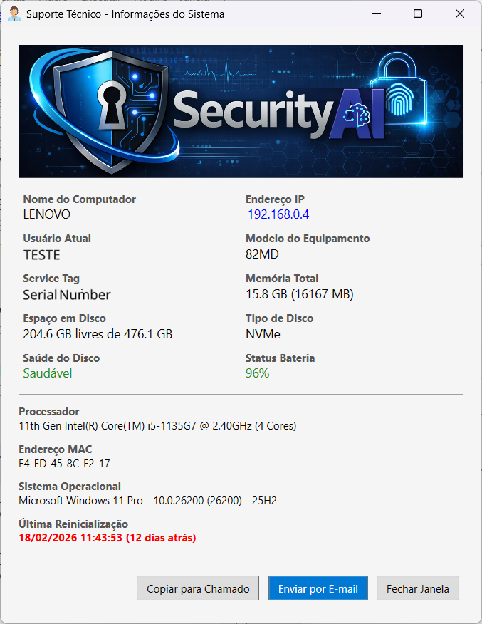

# 📊 InfoPC — Informações essenciais com segurança e governança

Este script PowerShell exibe informações da estação de trabalho em uma interface gráfica amigável, ideal para equipes de Service Desk em empresas de pequeno e médio porte.  
Trata-se de uma alternativa leve, rápida e segura frente a ferramentas como *msinfo32*, *ipconfig* ou soluções RMM comerciais, permitindo a coleta de dados essenciais sem exigir privilégios administrativos ou instalação de agentes adicionais.

Projetado sob princípios de **mínimo privilégio**, o utilitário opera localmente e não realiza alterações no sistema operacional.

## 🧭 Princípios de arquitetura

O InfoPC foi concebido com base em práticas modernas de segurança:

*   🔐 Execução com privilégios mínimos
*   🧱 Operação local (sem transmissão de dados)
*   🛡️ Redução de dependências externas
*   📉 Baixa superfície de ataque
*   🧩 Facilidade de auditoria e rastreabilidade

💡 Ferramentas internas também devem seguir o modelo de **Zero Trust**, onde nada é implicitamente confiável, mesmo dentro da rede corporativa.

## 🧰 Informações exibidas

*   Nome do Computador
*   Endereço IP e MAC
*   Usuário Atual (logado)
*   Modelo do Equipamento
*   Service Tag (Serial Number)
*   Processador (nome, núcleos, threads)
*   Memória Total (em MB e GB)
*   Espaço em disco (disponível e total)
*   Tipo de disco (NVMe / SSD / HD)
*   Saúde do disco
*   Status da bateria (se identificado como laptop)
*   Sistema Operacional (nome, versão, build)
*   Data da Última Reinicialização

<p align="center">

</p>

## 🖼️ Interface gráfica

A interface foi criada utilizando XAML com WPF via .NET e apresenta botões úteis:

*   **Copiar para chamado:** copia os dados para a área de transferência;
*   **Enviar por E-mail:** abre o cliente de e-mail com os dados no corpo da mensagem;
*   **Fechar Janela:** encerra a aplicação.

O código é totalmente personalizável possuindo, por exemplo, lógica de identificação automática da rede com base na VLAN detectada — classificando conexões como:

*   rede corporativa
*   rede VPN
*   rede externa

Esse recurso pode apoiar decisões de suporte e até alertas de conformidade.

Além disso, quando a última reinicialização do sistema tiver ocorrido há mais de **<span style="color:#EE0000">10 dias</span>** (configurável), o campo será destacado em **vermelho e negrito**, reforçando a importância da reinicialização periódica para aplicação de atualizações e correções de segurança.

## 🔐 Considerações de segurança

Este utilitário foi projetado para operar com segurança em ambientes corporativos. Ainda assim, recomenda-se seguir as práticas abaixo:

### ✔️ Assinatura Digital (ALTAMENTE recomendado)

Prefira assinar o script PowerShell com um certificado confiável.

**Benefícios:**

*   garante integridade
*   impede adulterações
*   aumenta a confiança do endpoint
*   atende políticas como **AllSigned**

**Nota:** O uso de `ExecutionPolicy Bypass` deve ser restrito a ambientes de teste ou cenários controlados.

### ✔️ Armazenamento Seguro

Evite diretórios amplamente acessíveis como:

*   `C:\Users\Public\`

Prefira:

*   `C:\Program Files\InfoPC`
*   ou outro diretório protegido por ACL.

**Motivo:** reduz o risco de substituição maliciosa do script.

### ✔️ Permissões NTFS

Recomendado:

*   Usuários → leitura e execução
*   Administradores → controle total

Isso evita alterações indevidas.

### ✔️ Distribuição Confiável

Distribua o utilitário apenas por canais gerenciados, como:

*   Microsoft Intune
*   GPO
*   ferramentas MDM
*   pipelines internos

Evite compartilhamentos abertos.

### ✔️ Telemetria e Privacidade

O SystemInfo:

*   ✅ não coleta dados externos;
*   ✅ não transmite informações;
*   ✅ não mantém persistência;
*   ✅ não realiza inventário oculto;
*   ✅ Opera exclusivamente sob demanda do usuário.

Essa abordagem reduz preocupações relacionadas à LGPD e auditorias de privacidade.

## 🚀 Como Usar

*   Armazene os arquivos .ps1, imagens e ícones em um diretório protegido.
*   Ajuste as permissões NTFS para permitir apenas leitura e execução aos usuários padrão.
*   Crie um atalho na Área de Trabalho Pública:

```powershell
powershell.exe -WindowStyle Hidden -ExecutionPolicy RemoteSigned -File "C:\ProgramData\InfoPC\InfoPC.PS1"
```

✅ **Recomendado:** executar scripts assinados respeitando a política de execução da organização.

### Política de Execução

Em ambientes corporativos, recomenda-se:

*   `AllSigned`
*   ou
*   `RemoteSigned`

Isso garante que apenas scripts confiáveis sejam executados:

```powershell
powershell.exe -WindowStyle Hidden -ExecutionPolicy RemoteSigned -File "C:\ProgramData\InfoPC\InfoPC.PS1"
```

## 🎯 Finalidade e contexto

### 🏢 Ambiente corporativo com Service Desk

Imagine um cenário em que o suporte remoto é realizado via ferramentas como Microsoft System Center Configuration Manager.

O sucesso da conexão depende da resolução correta entre hostname e IP.

### ⚠️ O Problema

O serviço DNS pode demorar a refletir a atualização do novo IP, principalmente em ambientes com replicação lenta ou regras específicas de VPN.

Resultado: conexões remotas falham ou são redirecionadas.

### ✅ A Solução

Executando o script localmente, o colaborador pode informar rapidamente seu IP ao analista.

**Menos fricção. Mais resolução.**

## 🛠️ Requisitos

*   Windows 10 ou superior
*   PowerShell 5.1 ou mais recente
*   .NET Framework compatível com WPF
*   Permissão de leitura para WMI/CIM
*   Execução de scripts conforme política corporativa

## 🧪 Estratégia de deploy (Nível corporativo)

Considere empacotar o utilitário como:

*   MSI
*   Win32
*   pacote corporativo

Isso garante:

*   versionamento
*   rollback
*   rastreabilidade
*   padronização

Ou criar um **script bat** para facilitar a distribuição em massa Isso permite integração via **GPO**, **Microsoft Intune** ou outras soluções MDM, além de garantir consistência no deploy.

A seguir, dispomos de um exemplo de script bat para deploy:

```bat
@echo off 
setlocal ENABLEEXTENSIONS 

:: === Configurações === 
set "SOURCE=\\SERVIDOR\TI\InfoPC" 
set "DEST=C:\ProgramData\InfoPC" 
set "DESKTOP_PUBLIC=C:\Users\Public\Desktop" 
set "SCRIPT=InfoPC.ps1" 
set "ICON=support-2.ico" 
set "LOG_DIR=C:\ProgramData\InfoPC\Logs" 

:: === Timestamp seguro === 
for /f "tokens=1-3 delims=/ " %%a in ("%date%") do set TODAY=%%c-%%b-%%a 
for /f "tokens=1-3 delims=:." %%a in ("%time%") do set NOW=%%a%%b%%c 
set "LOG_FILE=%LOG_DIR%\deploy-%TODAY%_%NOW%.log" 

if not exist "%LOG_DIR%" mkdir "%LOG_DIR%" 

echo ==== INICIO DO DEPLOY %date% %time% ==== >> "%LOG_FILE%" 

:: === Validar origem === 
if not exist "%SOURCE%" ( 
 echo [ERRO] Origem nao encontrada: %SOURCE% >> "%LOG_FILE%" 
 exit /b 1 
) 

:: === Criar destino === 
if not exist "%DEST%" ( 
 mkdir "%DEST%" 
) 

:: === Copia robusta === 
robocopy "%SOURCE%" "%DEST%" /MIR /R:2 /W:5 /NFL /NDL /NP >> "%LOG_FILE%" 

if %errorlevel% GEQ 8 ( 
 echo [ERRO] Falha na copia dos arquivos. Codigo: %errorlevel% >> "%LOG_FILE%" 
 exit /b 1 
) 

echo [OK] Arquivos sincronizados >> "%LOG_FILE%" 

:: === Remover bloqueio de arquivos baixados === 
powershell -NoProfile -ExecutionPolicy RemoteSigned ^ 
 -Command "Get-ChildItem '%DEST%' -Recurse \
 Unblock-File" >> "%LOG_FILE%" 2>&1 

echo [OK] Unblock aplicado >> "%LOG_FILE%" 

:: === Ocultar arquivos sensiveis === 
attrib +h "%DEST%\%SCRIPT%" 
attrib +h "%DEST%\%ICON%" 

:: === Criar atalho com politica segura === 
powershell -NoProfile -ExecutionPolicy RemoteSigned -Command ^ 
"$WshShell = New-Object -ComObject WScript.Shell; ^ 
$Shortcut = $WshShell.CreateShortcut('%DESKTOP_PUBLIC%\InfoPC.lnk'); ^ 
$Shortcut.TargetPath = 'powershell.exe'; ^ 
$Shortcut.Arguments = '-NoProfile -ExecutionPolicy RemoteSigned -WindowStyle Hidden -File ""%DEST%\%SCRIPT%""'; ^ 
$Shortcut.IconLocation = '%DEST%\%ICON%'; ^ 
$Shortcut.Save()" 

if exist "%DESKTOP_PUBLIC%\SystemInfo.lnk" ( 
 echo [OK] Atalho criado >> "%LOG_FILE%" 
) else ( 
 echo [ERRO] Falha ao criar atalho >> "%LOG_FILE%" 
) 

echo. 
echo ================================================== >> "%LOG_FILE%" 
echo RECOMENDACAO DE SEGURANCA: >> "%LOG_FILE%" 
echo Migrar o script para um EXECUTAVEL ASSINADO digitalmente. >> "%LOG_FILE%" 
echo Politica ideal corporativa: AllSigned. >> "%LOG_FILE%" 
echo ================================================== >> "%LOG_FILE%" 
echo ==== FIM DO DEPLOY ==== >> "%LOG_FILE%" 

endlocal 
exit /b 0
```

## 🧩 Complemento ao Suporte Remoto via ITSM

Ferramentas como GLPI permitem integrar soluções de acesso remoto ao chamado — seja via plugins como **Tviewer** (compatíveis com TeamViewer, AnyDesk e VNC) ou links personalizados no ticket.

Ainda assim, conexões podem falhar por:

*   DNS desatualizado
*   IP dinâmico
*   sessões VPN

O SystemInfo atua exatamente nesse ponto crítico.

## 📦 Governança e Auditoria

Este utilitário pode ser adotado com segurança em ambientes que exigem:

*   controles internos
*   rastreabilidade
*   conformidade
*   auditorias técnicas

Sua arquitetura simples favorece revisões de código e validações periódicas.

## 📦 Versão

[**InfoPC.ps1**](../../scripts/InfoPC.ps1)
 
Versão: v2.0.0

## 🤝 Contribuições

Sinta-se à vontade para usar, adaptar e sugerir melhorias.

## Licença

- Os **scripts PowerShell** deste repositório estão licenciados sob a [MIT License](../../LICENSE).
- As **orientações, dicas e textos** estão licenciados sob [Creative Commons Attribution-ShareAlike 4.0 International (CC BY-SA 4.0)](https://creativecommons.org/licenses/by-sa/4.0/).
